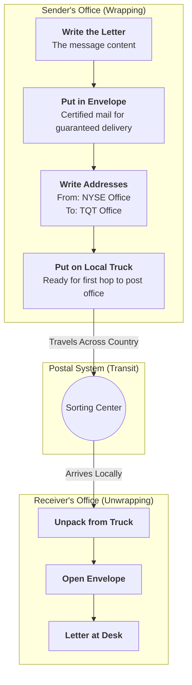
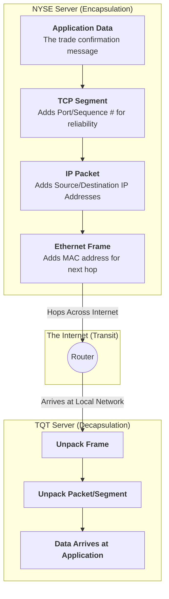

```mermaid +render
graph TD
    subgraph "Sender's Office (Wrapping)"
        A1["<strong>Write the Letter</strong><br>The message content"]
        B1["<strong>Put in Envelope</strong><br>Certified mail for guaranteed delivery"]
        C1["<strong>Write Addresses</strong><br>From: NYSE Office<br>To: TQT Office"]
        D1["<strong>Put on Local Truck</strong><br>Ready for first hop to post office"]
    end

    subgraph "Postal System (Transit)"
        E1((Sorting Center))
    end

    subgraph "Receiver's Office (Unwrapping)"
        F1["<strong>Unpack from Truck</strong>"]
        G1["<strong>Open Envelope</strong>"]
        H1["<strong>Letter at Desk</strong>"]
    end

    A1 --> B1 --> C1 --> D1
    D1 -- Travels Across Country --> E1
    E1 -- Arrives Locally --> F1
    F1 --> G1 --> H1
```

<!-- column: 2 -->

```mermaid +render 
graph TD
    subgraph "NYSE Server (Encapsulation)"
        A2["<strong>Application Data</strong><br>The trade confirmation message"]
        B2["<strong>TCP Segment</strong><br>Adds Port/Sequence # for reliability"]
        C2["<strong>IP Packet</strong><br>Adds Source/Destination IP Addresses"]
        D2["<strong>Ethernet Frame</strong><br>Adds MAC address for next hop"]
    end

    subgraph "The Internet (Transit)"
        E2((Router))
    end

    subgraph "TQT Server (Decapsulation)"
        F2["<strong>Unpack Frame</strong>"]
        G2["<strong>Unpack Packet/Segment</strong>"]
        H2["<strong>Data Arrives at Application</strong>"]
    end

    A2 --> B2 --> C2 --> D2
    D2 -- Hops Across Internet --> E2
    E2 -- Arrives at Local Network --> F2
    F2 --> G2 --> H2
```