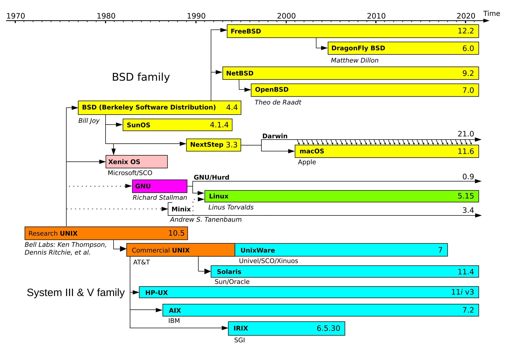
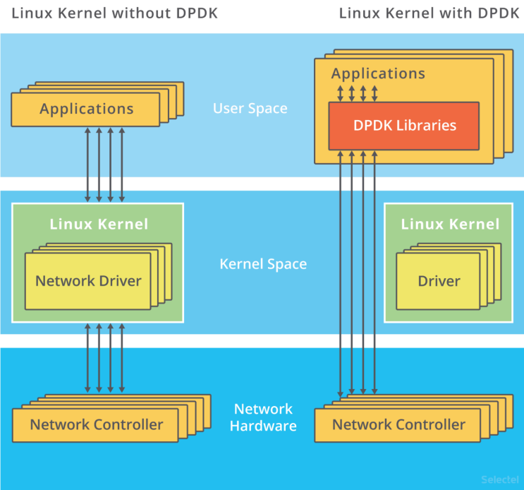

---
theme:
  path: theme.yaml
  override:
    default:
      margin:
        percent: 8

title: learn linux
sub_title: and why you should care
author: Kyle Trinh
---

<!-- font_size: 1 -->
whoami
===

<!-- column_layout: [2, 2] -->

<!-- column: 0 -->

# main
* 4th year, computer science + mathematics
* sacramento, ca

## job
* operating systems intern @ ServiceNow
* swe intern @ Insulet Corporation
* research @ Kale Research Group
* research @ UCSD Computational Number Theory
* research / swe @ Center for Applied Internet Data Analysis

### links
* github.com/pink10000
  * source code / pdf available at the end
* linkedin.com/in/kytrinh
* kytrinh.me


#### acknolwedgements

built with 
- `presenterm` (slides) 
- `kitty` (presentation medium)
- color scheme: ibm oxocarbon base-16
- font: berkeley mono

<!-- column: 1 -->


<!-- alignment: center -->
 pasadena, california

<!-- end_slide -->

what is an operating system?
===
<!-- 
  speaker_note: |
  An operating system is a collection of software that manages a computer's hardware and applications by allocating resources. 
 -->

<!-- new_lines: 4 -->
<!-- font_size: 3 -->
> An operating system is a collection of software that manages a computer's hardware and applications by allocating resources. 

<!-- end_slide -->


pronounciation
===
<!-- column_layout: [3, 1] -->
<!-- column: 0 -->
<!-- new_lines: 4 -->

```bash +exec
curl https://upload.wikimedia.org/wikipedia/commons/0/03/Linus-linux.ogg | ffplay -v 0 -nodisp -autoexit -
```

<!-- column: 1 -->
<!-- new_lines: 7 -->


<!-- reset_layout -->
*Did you know?*

Linux Torvalds announced in 1996 that there would be a mascot for Linux, a penguin. This was because when they were about to select the mascot, Torvalds mentioned he was bitten by a little penguin (Eudyptula minor) on a visit to the National Zoo & Aquarium in Canberra, Australia. It's name is `Tux`.

Source: `https://archive.org/details/justforfun00linu/page/84/mode/2up` 

<!-- end_slide -->

<!-- jump_to_middle -->
brief history 
===
<!-- end_slide -->


<!-- 
  speaker_note: |
  So, to really understand Linux, we need to go back to the beginning. Before every modern operating system, we had UNIX.
  
  In 1969, Ken Thompson, Dennis Ritchie, and others at Bell Labs begin development on UNIX. It established many core concepts like the command-line interface, hierarchical file system, and the "everything is a file" philosophy that Linux would later adopt.
  
  More importantly, they developed the UNIX Philosophy. The idea is to create small, simple programs that each do only one thing, but do it really well. 
  
  The real power comes from chaining these simple tools together to perform incredibly complex tasks, which is a theme we'll see over and over today.

  So, UNIX was revolutionary, stable, and powerful. But, it was proprietary corporate software owned by AT&T. You couldn't freely study its source code, you couldn't share it, and you couldn't modify it to fit your needs.

  This limitation is what inspired Linux.
 -->
<!-- font_size: 2 -->
# 1969: UNIX 

<!-- alignment: center -->
Ken Thompson & Dennis Ritchie

<!-- end_slide -->


<!-- 
  speaker_note: |
  This brings us to the next pivotal moment in our story, launched in 1983 by a programmer at MIT named Richard Stallman. This was the GNU Project.

  Their goal was to build a complete operating system that was entirely free software.

  In particular, 'free' meant 
  - being able to run any program for any purpose
  - being able to read and change source code,
  - being able to share software with anyone,
  - and being able to distribute your software. 

  It means you can audit the tools you use for security, customize them for performance, and ensure you're never locked into a single vendor's ecosystem (like Apple!).
-->
<!-- font_size: 2 -->
# 1983: GNU Project
<!-- new_lines: 3 -->


<!-- end_slide -->


<!-- 
  speaker_note: |
  Linus Torvalds, a student in Finland, posted online about his hobby project: a free, UNIX-like kernel from scratch.

  What he actually was working on, was a kernel for GNU tools to run on, setting the stage for a completely free operating system.

  ---
  Link: https://www.redhotcyber.com/en/post/the-history-of-the-linux-kernel-1-of-2-from-torvalds-to-the-hacker-community/

-->
<!-- font_size: 2 -->
# 1991: Linus Torvalds
<!-- new_lines: 3 -->

<!-- alignment: center -->
Linus Torvalds


<!-- end_slide -->

<!-- 
  speaker_note: |
  At this point in time, the Linux kernel is licensed under the GNU General Public License or GPL. It allows developers to legally combine the GNU project's tools with the Linux kernel to create a complete, free operating system, often called GNU/Linux.
  ---
  In reality, no one calls it GNU/Linux, just Linux. You'll seem pretentious if you do.
 -->
<!-- font_size: 2 -->
# 1992: GNU/Linux

<!-- alignment: center -->
GNU Timeline

<!-- end_slide -->


<!-- 
  speaker_note: | 
  The first major Linux distributions, like Slackware, Debian, Red Hat Linux are created. These packages bundle the kernel with software and a package manager, making Linux accessible to a wider audience. 

  Commerical companies began selling and supporting Linux distributions
  For example, 
  - 1999: IBM joined forces with Red Hat, announcing support for Linux
  - 1999: Dell began pre-installing Linux on select servers
  - 2000: The GNOME and KDE desktop environments evolved, making Linux more user friendly for desktop users.
  - 2000: IBM invested $1 billion in Linux development.
  This, combined with the rise of the internet, led to Linux becoming the backbone of the dot-com boom and powered web servers around the world.
  ---
  We won't go in depth into what Linux distributions there are or how they're different. Instead, we'll go into the basics of Linux.
-->
<!-- font_size: 2 -->
# 1993-2000: Major Linux Distributions
<!-- new_lines: 3 -->

<!-- alignment: center -->
Common Linux Distributions

<!-- end_slide -->


<!-- 
  speaker_note: |
  Google launches Android, an operating system for mobile devices built on top of the Linux kernel. This puts Linux into the hands of billions of users globally.
 -->
<!-- font_size: 2 -->
# 2007: Android
<!-- new_lines: 3 -->

<!-- alignment: center -->
Android Timeline

<!-- end_slide -->

<!-- 
  speaker_note: |
  Today, linux completely dominates cloud computing, super computing, and IoT devices. It runs on the vast majority of the world's servers and is even integrated with Microsoft via the Windows Subsystem for Linux (WSL).

  We also see Linux has been growing among steam users.

 -->
<!-- font_size: 2 -->
# Today: Ubiquity
<!-- font_size: 1 -->
<!-- new_lines: 3 -->

<!-- alignment: center -->
Steam Hardware Survey by OS: September 2025

<!-- end_slide -->

<!-- jump_to_middle -->
why linux? 
===
<!-- 
  speaker_note: |
  Well, why Linux? I could spent the next hour raving why, but for engineers, the answer boils down to 2 reasons:
  1. Performance
  2. Automation
 -->
<!-- end_slide -->


<!-- jump_to_middle -->
terminals, cli, and more
===
<!-- 
  speaker_note: |
  The single most important tool to Linux is the terminal. Most work you do will probably be interfaced through the terminal. 
  
  three different tools:
  - terminal (the window)
  - the shell (the program running inside the terminal)
  - command line interface
 -->
<!-- end_slide -->


terminals, cli, and more
===
<!-- 
  speaker_note: |
  live demo!
  ---
  script: 
  ```bash
  grep 'ERROR' trader.log | cut -d '"' -f 2 | sort | uniq -c | sort -nr
  ```
  explain each part and reasoning
  - piping |
  - why we use `cut` and what it is used for
  - sort
  - `uniq` sorts unique lines, `-c` is used to count
  - sort

  at the end, explain what `man` is
 -->

# Scenario 1

You're a `Quant Developer` at Triton Quantitative Trading. It's 7:56 AM on a Tuesday, just minutes before the market opens. Suddenly, the monitoring dashboard lights up—there's a massive spike in failed orders across the system.

As if the morning wasn't chaotic enough, your phone buzzes with a notification: the UCSD Guardian just announced that AS Judicial Board has forced `ACM to split into ACM AI and ACM Cyber`.

Your no-nonsense, JEE topper, 4x IMO Gold medalist team lead rushes to your desk and says:

> "I need you to triage this, now. Don't try to fix anything—we just need to find the biggest fire. I've pulled the raw application log from the production server; it's a multi-gigabyte file named `trader.log` with millions of lines. You can't open it in a regular editor."

The system is bleeding money with every failed trade. The team's immediate debugging efforts depend entirely on your findings.

**Your Mission**: Identify the top 5 most frequent error messages from the log file. How do you do it?

<!-- end_slide -->


Package Management
---
<!-- 
  speaker_note: |

  1. You're a new ...
  2. You need to see if your strategy is actually profitable. Does the PnL curve go up and to the right, or does it crash and burn?
  3. You ask ...
  4. This is a game changer.
  5. You go back ...

  Live demo:
  - setup docker daemon: `sudo dockerd &`
  - load up ubuntu docker `docker run -it --rm -v "$(pwd)"/demo2:/data ubuntu:latest bash`
  - run `gnuplot`
    - as we can see, we do not have the command line tool `gnuplot`
  - run `apt update`
    - there are many different package managers. in general, if you know how to use one, you can use the rest
    - for ubuntu, the package manager is `apt`
  - run `apt install -yq gnuplot`
    - It's important to mention where these packages come from. 
    - I'll explain next slide
  - run `cat /data/pnl_over_time.csv | gnuplot /data/plot.gp`
  - go back to own terminal and run `kitten icat pnl_plot.png`

 -->
# Scenario 2
<!-- font_size: 1 -->
You're a new analyst at Triton Quantitative Trading. You've spent all week running your first major backtest on a new strategy. The simulation finally finishes, generating a simple CSV file named `pnl_over_time.csv`.

You ask a senior quant how they quickly visualize data on the server. They say:

> Oh, never pull the data down just for a quick plot. Just use a terminal-based plotting tool. I use one called gnuplot. It's the fastest way to see your PnL curve.

You go back to your terminal and type:
```bash
cat pnl_over_time.csv | gnuplot
```
But instead of the beautiful PnL chart you were expecting, you get this:
```
-bash: gnuplot: command not found
```

<!-- end_slide -->


package management
---
<!-- speaker_note: |
  So in our scenario, we had the perfect tool for the job, but it wasn't installed. 
  Instead of having to go online, find the tool, clone it, compile it (which btw, 
    is much harder than it sounds), and then run it, 
  the tool `apt` did all the hardwork for us.

  Back in the day, this what programmers had to do. This has now been solved by 
    package managers.
  
  ---
  
  Here are examples of package managers across different machines.

  Most notably, `winget` did not exist until 2021, whereas 
  - `brew` came out in 2009, 
  - `pacman` in 2002

  ---
  When you install a package, you're interacting with a secure supply chain 
  designed to ensure the software is authentic and safe. Here’s how it works:
  - Developer Creates Software: A developer or a team writes the source code for an application, like gnuplot.
  - Maintainer Packages It: A trusted individual, known as a package maintainer, takes that source code. 
    They are typically volunteers or employees of the Linux distribution (like Debian or Arch). Their job is to:
    - Compile the code for your system.
    - Test it to make sure it works correctly.
    - Package it into the correct format.
    - These packages get signed and uploaded to ensure they are authentic.
  - When you run a command like `sudo apt install gnuplot`, the package manager 
    contacts the repository, downloads the package, verifies the signature, and installs the package.
  ---
  - You have trust someone. Unless you want to review and compile the millions
    or even billions of lines of code, you are going to have to trust that the code 
    you get is legitimate
  - For example, the linux kernel itself reached 40 million lines of code in January of this year
    - https://www.stackscale.com/blog/linux-kernel-surpasses-40-million-lines-code/ 
  - In general, the maintainers of the packages you use are vette by the organizations that 
    provide your distribution of Linux. 
  - The entire process is open, so anyone, including your grandmother can take a look at it. 

  --- 
  XZ BREACH 
  - Around 2021, a new developer known as Jia Tan (we'll call him JT) started contributing 
    to `xz`, an unzipping tool found in almost every Linux machine.
  - Over 3 years, he built trust my submitting pactches and contributing to the project. 
  - At some point JT had full control over the project. In early 2024, JT inserted malicious
    code into the system. A few weeks later, an engineer at Microsoft uncovered the 
    code when he noticed that logging into a remote server took him an extra 500 milliseconds.
  - He eventually found the malicious code because the code was publically available. 
  - Had the `xz` backdoor stayed hidden, millions of users would have been compromised.

  --- 
  NPM BREACH
  - In another instance, on September 8, 2025, one of the largest supply chain incidents, 
  happened to `npm`, the largest software registry in the world. 
  - Popular libraries and other utilities were hijacked, and had malicious code pushed
    targeting cryptocurrency wallets and blockchain transactions.
  - These packages collectively have billions of weekly downloads, making this compromise 
    both widespread and extremely dangerous.

 -->
<!-- column_layout: [1, 1] -->
<!-- column: 0 -->
# examples
- apt     (Debian / Ubuntu)
- pacman  (Arch Linux)
- brew    (macOS)
- winget  (Windows)
- nix     (NixOS)
- dnf     (RedHat)
- pip, uv, cargo, npm, gradle
- iOS App Store, Android Play

# where do packages come from
- centralized online repositories
- developer creates software (like `gnuplot`)
- maintainer packages it
- compiled for system

# trust and security 
- you have to trust someone
- vetted maintainers
- transparency
- xz utils, npm supply chain attack


<!-- column: 1 -->


<!-- end_slide -->


basic networking
===
<!-- 
  speaker_note: | 
  Network traffic travels in small chunks called packets. Before a packet is sent 
  from the Gilman Stock Exchange to our TQT servers, it's wrapped in layers, just 
  like a letter being prepared for shipping.

  First, the message itself is wrapped in a TCP Segment. This is like a 
  "certified mail" envelope that adds port numbers to ensure it gets to the right 
  application and sequence numbers to guarantee it arrives without errors.

  Then, it's wrapped again in an IP Packet, which adds the full source and 
  destination addresses, like addressing the envelope.

  When the packet arrives at our TQT servers, the Linux kernel unwraps each of 
  these layers before feeding the clean data into our algorithms.

  This process is reliable, but as you can see, a cross-country trip takes about 35 milliseconds. 
  For normal internet use, that's instant. For high-frequency trading, it's an eternity. 
  That's why firms co-locate their servers right next to the exchange, to get that time down 
  below 0.1 milliseconds (100 microseconds). 
  
  But even then, the kernel itself is still too slow.
 -->

<!-- column_layout: [2, 1, 1] -->
<!-- column: 0 -->
# Scenario 3
The Gilman Stock Exchange just executed one of our TQT orders. It needs to send us a tiny message that says: 

> "You bought 100 shares of SPY at $550.10." 

How does that message cross the country in about 35 milliseconds? 10 miliseconds? 0.1 miliseconds? 

<!-- column: 1 -->
<!-- include: assets/basic_networking.md -->

<!-- end_slide -->


advanced networking
===
<!-- speaker_note: |
  - The Linux kernel is a massive bottleneck. You can think of it like a corporate mailroom. 
  - The packet arrives at the loading dock (the network card), but before it gets to your desk (your application), 
    the mailroom has to stop all other work (interrupts), open and log the package (system calls), make a 
    photocopy of it for their records (data copying), and then finally deliver it. 
  - This process is safe and orderly, but it's incredibly slow when every microsecond counts.  
 -->

# kernel processing bottleneck
- shared listening socket
- system calls (context switching)
- data copying, buffering
- interrupts
- queueing delays
- cpu scheduling delays
- inefficient processing

<!-- end_slide -->


advanced networking
===
<!-- speaker_note: |
  Knowing this, we can use some special libraries to skip the kernel. 
  - One major tool is dataplane development kit or dpdk. It's a set of libraries
    and drivers for fast packet processing. Originally developed by Intel, 
    it's now widely used for networking research and HFT applications.
  - DPDK bypasses the entire Linux networking stack by allowing applications to access the NIC 
    directly.  
  - In DPDK, you can pin a CPU core to handle all network traffic. 
    This eliminates CPU scheduling delays. Polling the NIC reduces context switching overhead.
  - Again, we really want systems with extremely low latency so this is quite helpful.
  
  ---
  
  - could use eBPF, but different from DPDK
    - keep the kernel, balance speed and flexibility
    - accelerate networking, but you still benefit from kernel's robust and mature features
    - advanced observability and security
    - safer

  ---
  We can also use Smart NICs, which are network interface cards with built-in processing 
  capabilities. We can offload certain tasks directly to the NIC, reducing the load on the CPU.

  This is a more modern approach used heavily in cloud networking and security.

 -->

<!-- column_layout: [1, 1] -->
<!-- column: 0 -->
# dataplane development kit (dpdk)
- ignore kernel networking stack
- user space packet processing
- poll network interface card (NIC)
- pin dedicated cpu core

# extended Berkeley Packet Filter (eBPF)
- in-kernel programmable packet processing
- balance speed and flexibility

# hardware optimizations
- dedicated cpu core
- direct memory access 
- smart NICs


<!-- column: 1 -->

<!-- alignment: center -->
UIUC, ECE 598, FA20

<!-- reset_layout -->

SmartNIC Layout

<!-- end_slide -->


high performance computing
===
<!-- speaker_note: |
  1. It's Friday ... 
  2. Is your code inefficient? Is it a hardware problem? Linux gives you the tools to be a performance detective.
  3. Play scenario audio 
  4. What's wrong?
  ---
  LIVE DEMO!
  inspect, monitor, and profile

  1. run ./backtest1
  2. open another terminal and run `top`, `htop`, `btop`
  3. see it is slow. "Oh! that's why it's so slow! it's only using one core!"
  4. kill backtest1
  5. run ./backtest2
  6. open another terminal and run `top`, `htop`, `btop`
  7. see it is fast. "Wow! it's using all cores! that's why it's so much faster!"
  8. quit program.

  ---
  Conclusion:
  - The point of this scenario is to show you that Linux gives you the tools to 
    inspect, monitor, and profile your code.
  - In this case, the first backtest was only using one core, which is why
    it was so slow. The second backtest used all cores, making it much faster.
  - In reality, performance issues are often more subtle and complex,
    but with Linux, you have the tools to investigate and optimize your code.

 -->

# Scenario 4
It's Friday late afternoon at the TQT office. GSE just closed, and it's time for you to start backtesting your new trading strategy on a powerful server. 
You expect it to take an hour. Three hours later, it's still running. Worse yet, your team manager walks by and asks:

> "Why is your backtest taking so long? Is it the code or the hardware? I expect you to finish before the weekend. Also, the company values your time and well-being, so I'm kicking you out early today. Our new CEO Rudy just sent out a company-wide email about work-life balance."

What's wrong?

<!-- end_slide -->


nix-shell (reproducible environments)
===


<!-- end_slide -->
conclusion
===

<!-- end_slide -->
q&a
===

<!-- end_slide -->