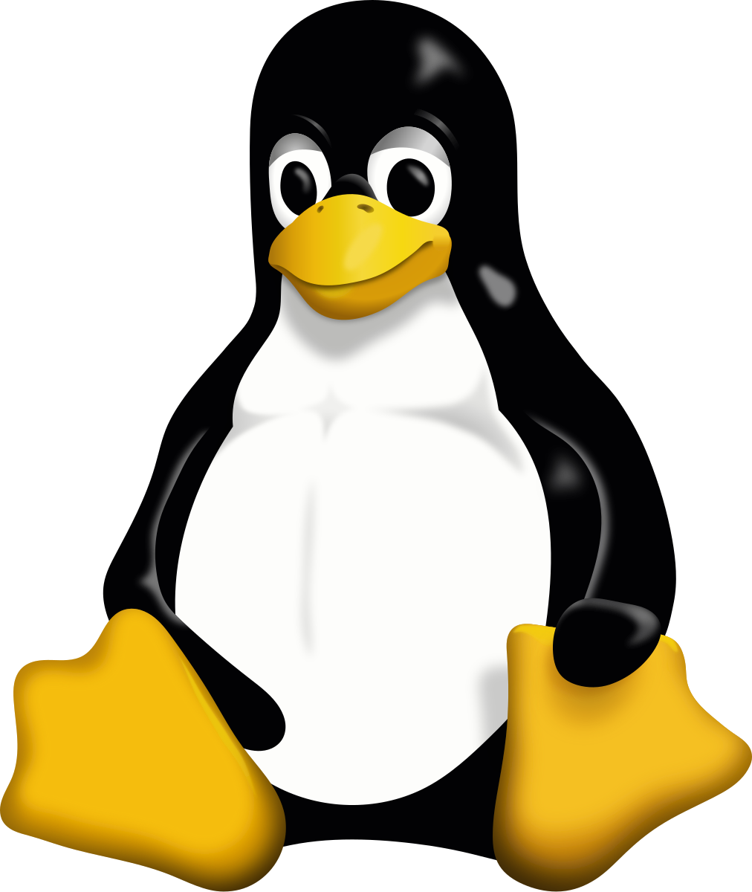
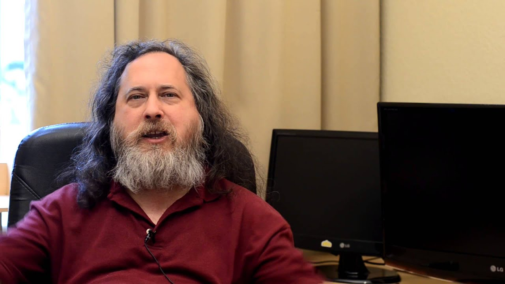
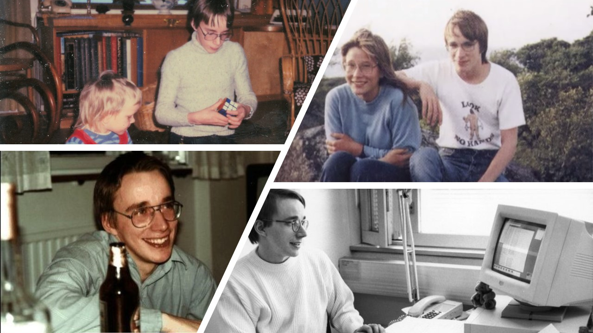

---
theme:
  path: theme.yaml
  override:
    default:
      margin:
        percent: 8

title: learn linux
sub_title: and why you should care
author: Kyle Trinh
---

<!-- font_size: 1 -->
whoami
===

<!-- column_layout: [2, 2] -->

<!-- column: 0 -->

# main
* 4th year, computer science + mathematics
* sacramento, ca

## job
* operating systems intern @ ServiceNow
* swe intern @ Insulet Corporation
* research @ Kale Research Group
* research @ UCSD Computational Number Theory
* research / swe @ Center for Applied Internet Data Analysis

### links
* github.com/pink10000
  * source code / pdf available at the end
* linkedin.com/in/kytrinh
* kytrinh.me


#### acknolwedgements

built with 
- `presenterm` (slides) 
- `kitty` (presentation medium)
- color scheme: ibm oxocarbon base-16
- font: berkeley mono

<!-- column: 1 -->


<!-- alignment: center -->
 pasadena, california

<!-- end_slide -->

what is an operating system?
===
<!-- 
  speaker_note: |
  An operating system is a collection of software that manages a computer's hardware and applications by allocating resources. 
 -->

<!-- new_lines: 4 -->
<!-- font_size: 3 -->
> An operating system is a collection of software that manages a computer's hardware and applications by allocating resources. 

<!-- end_slide -->


pronounciation
===
<!-- column_layout: [3, 1] -->
<!-- column: 0 -->
<!-- new_lines: 4 -->

```bash +exec
curl https://upload.wikimedia.org/wikipedia/commons/0/03/Linus-linux.ogg | ffplay -v 0 -nodisp -autoexit -
```

<!-- column: 1 -->
<!-- new_lines: 7 -->


<!-- reset_layout -->
*Did you know?*

Linux Torvalds announced in 1996 that there would be a mascot for Linux, a penguin. This was because when they were about to select the mascot, Torvalds mentioned he was bitten by a little penguin (Eudyptula minor) on a visit to the National Zoo & Aquarium in Canberra, Australia. It's name is `Tux`.

Source: `https://archive.org/details/justforfun00linu/page/84/mode/2up` 

<!-- end_slide -->

<!-- jump_to_middle -->
brief history 
===
<!-- end_slide -->


<!-- 
  speaker_note: |
  So, to really understand Linux, we need to go back to the beginning. Before every modern operating system, we had UNIX.
  
  In 1969, Ken Thompson, Dennis Ritchie, and others at Bell Labs begin development on UNIX. It established many core concepts like the command-line interface, hierarchical file system, and the "everything is a file" philosophy that Linux would later adopt.
  
  More importantly, they developed the UNIX Philosophy. The idea is to create small, simple programs that each do only one thing, but do it really well. 
  
  The real power comes from chaining these simple tools together to perform incredibly complex tasks, which is a theme we'll see over and over today.

  So, UNIX was revolutionary, stable, and powerful. But, it was proprietary corporate software owned by AT&T. You couldn't freely study its source code, you couldn't share it, and you couldn't modify it to fit your needs.

  This limitation is what inspired Linux.
 -->
<!-- font_size: 2 -->
# 1969: UNIX 

<!-- alignment: center -->
Ken Thompson & Dennis Ritchie

<!-- end_slide -->


<!-- 
  speaker_note: |
  This brings us to the next pivotal moment in our story, launched in 1983 by a programmer at MIT named Richard Stallman. This was the GNU Project.

  Their goal was to build a complete operating system that was entirely free software.

  In particular, 'free' meant 
  - being able to run any program for any purpose
  - being able to read and change source code,
  - being able to share software with anyone,
  - and being able to distribute your software. 

  It means you can audit the tools you use for security, customize them for performance, and ensure you're never locked into a single vendor's ecosystem (like Apple!).
-->
<!-- font_size: 2 -->
# 1983: GNU Project
<!-- new_lines: 3 -->


<!-- end_slide -->


<!-- 
  speaker_note: |
  Linus Torvalds, a student in Finland, posted online about his hobby project: a free, UNIX-like kernel from scratch.

  What he actually was working on, was a kernel for GNU tools to run on, setting the stage for a completely free operating system.

  ---
  Link: https://www.redhotcyber.com/en/post/the-history-of-the-linux-kernel-1-of-2-from-torvalds-to-the-hacker-community/

-->
<!-- font_size: 2 -->
# 1991: Linus Torvalds
<!-- new_lines: 3 -->

<!-- alignment: center -->
Linus Torvalds


<!-- end_slide -->

<!-- 
  speaker_note: |
  At this point in time, the Linux kernel is licensed under the GNU General Public License or GPL. It allows developers to legally combine the GNU project's tools with the Linux kernel to create a complete, free operating system, often called GNU/Linux.
  ---
  In reality, no one calls it GNU/Linux, just Linux. You'll seem pretentious if you do.
 -->
<!-- font_size: 2 -->
# 1992: GNU/Linux

<!-- alignment: center -->
GNU Timeline

<!-- end_slide -->


<!-- 
  speaker_note: | 
  The first major Linux distributions, like Slackware, Debian, Red Hat Linux are created. These packages bundle the kernel with software and a package manager, making Linux accessible to a wider audience. 

  Commerical companies began selling and supporting Linux distributions
  For example, 
  - 1999: IBM joined forces with Red Hat, announcing support for Linux
  - 1999: Dell began pre-installing Linux on select servers
  - 2000: The GNOME and KDE desktop environments evolved, making Linux more user friendly for desktop users.
  - 2000: IBM invested $1 billion in Linux development.
  This, combined with the rise of the internet, led to Linux becoming the backbone of the dot-com boom and powered web servers around the world.
  ---
  We won't go in depth into what Linux distributions there are or how they're different. Instead, we'll go into the basics of Linux.
-->
<!-- font_size: 2 -->
# 1993-2000: Major Linux Distributions
<!-- new_lines: 3 -->

<!-- alignment: center -->
Common Linux Distributions

<!-- end_slide -->


<!-- 
  speaker_note: |
  Google launches Android, an operating system for mobile devices built on top of the Linux kernel. This puts Linux into the hands of billions of users globally.
 -->
<!-- font_size: 2 -->
# 2007: Android
<!-- new_lines: 3 -->

<!-- alignment: center -->
Android Timeline

<!-- end_slide -->

<!-- 
  speaker_note: |
  Today, linux completely dominates cloud computing, super computing, and IoT devices. It runs on the vast majority of the world's servers and is even integrated with Microsoft via the Windows Subsystem for Linux (WSL).

  We also see Linux has been growing among steam users.

 -->
<!-- font_size: 2 -->
# Today: Ubiquity
<!-- font_size: 1 -->
<!-- new_lines: 3 -->

<!-- alignment: center -->
Steam Hardware Survey by OS: September 2025

<!-- end_slide -->


<!-- font_size: 2 -->
# why linux? 


<!-- end_slide -->
cd (cli fundamentals)
===

<!-- end_slide -->
apt/pacman/brew (package management)
===

<!-- end_slide -->
ping (basic networking)
===

<!-- end_slide -->
lscpu (high performance computing)
===

<!-- end_slide -->
nix-shell (reproducible environments)
===

<!-- end_slide -->
(git) linux @ a job
===

<!-- end_slide -->
conclusion
===

<!-- end_slide -->
q&a
===

<!-- end_slide -->